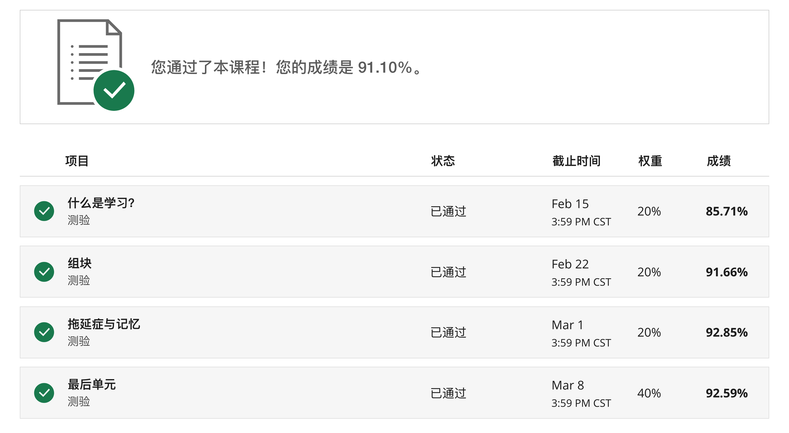
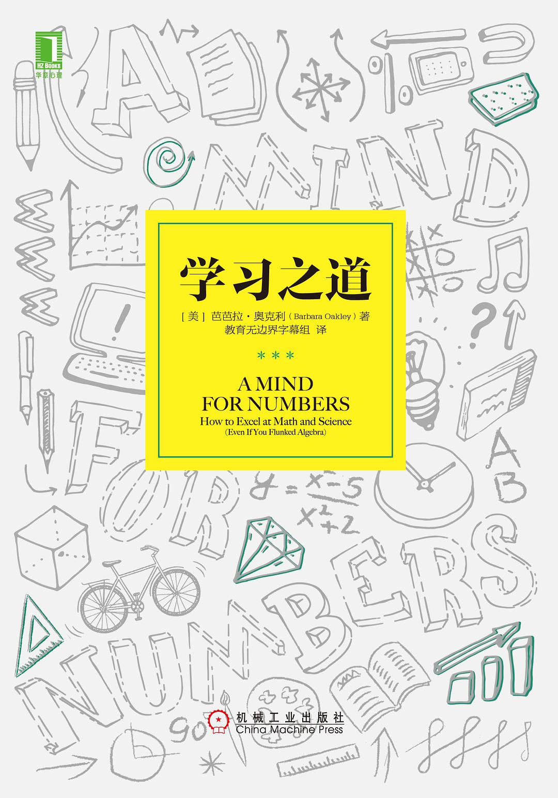
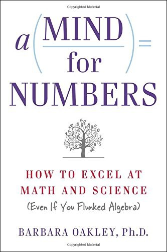
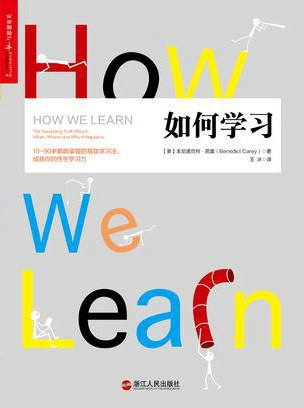
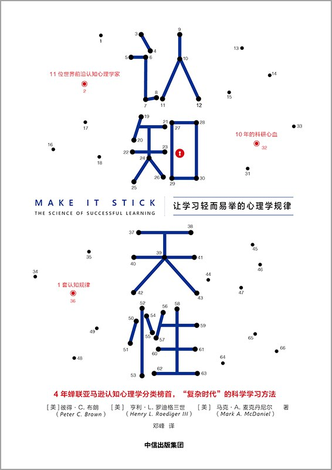

最近刚刚在MOOC平台[Coursera](https://www.coursera.org/)上学习了一个课程：《学会如何学习：帮助你掌握复杂学科的强大智力工具（Learning How to Learn）》，推荐给大家。

虽然是英文视频，但有中文字幕，学习起来不算吃力。以下是我这门课的成绩。

主讲的两位导师Barbara Oakley和Terrence Sejnowski都是相关领域的大师级人物，能够直接聆听国际大师的指导是很幸运的事情啊。其中Barbara Oakley（芭芭拉·奥克利）我并不陌生，因为我在2016年就拜读过她的大作：[《学习之道》](https://book.douban.com/subject/26895988/)。

当时读完之后还写了一篇读书笔记：[《学习之道》读书笔记](https://ewangplay.github.io/2016/12/03/%E3%80%8A%E5%AD%A6%E4%B9%A0%E4%B9%8B%E9%81%93%E3%80%8B%E8%AF%BB%E4%B9%A6%E7%AC%94%E8%AE%B0/)。

这门课程跟《学习之道》的内容相呼应，可以说它的参考教材就是这本书。这一点在课程介绍中有明确说明：

> 如果你希望作好更充分的准备，那么可以选读 《数字思维》（非必修内容，但却是此MOOC的基础教材）。该书也已有华语简体版《学习之道》和华语繁体版 《用對腦，從此不再怕數字：學會如何學習，以如何創意思考，解決(幾乎)所有的問題》。

这本书的原版叫“A Mind for Numbers”，看起来像一本数学相关的书，让人望而生畏。翻译过来的名字“学习之道”我倒觉得蛮恰当的，因为本书介绍的学习方法和技巧虽然是针对理工科的知识体系，但实际上有更大的应用价值，算是比较通用的学习理念和方法，对于其它学科的学习也大有借鉴。

在学习这门课程的同时，除了参考《学习之道》这本书外，另外再推荐两本书。

[《如何学习》](https://book.douban.com/subject/27081766/)

[《认知天性》](https://book.douban.com/subject/30353486/)

这几本书的内容相互关联，属于相同的认知科学应用领域，内容上有重叠，也有补充，结合起来看就很全面了。

课程的内容总结上，大家可以参考我写的那篇《学习之道》的读书笔记，同时，我把一些新的内容或关键点再列出来，作为补充：

1. 专注模式和发散模式

我们的大脑工作在两种模式之下，一种叫专注模式，一种叫发散模式。专注模式跟意识相关，讲究条理性、逻辑性、专注性；发散模式跟潜意识相关，讲究跳跃性、整体性、全局性。

打个形象的比喻，这两种思维模式就好比手电筒的聚焦模式和广角模式。在聚焦模式下，亮度很强，可以很清楚的看清一块地方，但范围有限。在广角模式下，亮度比较弱，但却可以看见更大的一片区域。
解决问题的过程中，要合理利用两种模式，相互切换，既能自上而下地从整体全局上定位问题，也能自下而上地从知识组块上解决问题。

2. 交叉学习

我们传统的学习习惯是一段时间之内就学习一门学科，不建议进行切换，因为觉得这样会分心、增加切换成本。

但最新的认知科学却告诉我们，长时间固定在一门学科上学习效果并不好，应该不同学科或者同一学科内的不同主题交叉着进行学习，这样的学习效果会更好。

就拿我平时的几项学习活动来说，读书、写作、学英语、看视频，如果我在一项活动上花费的时间太长，效率就会下降，兴趣和积极性也会降低，我是能明显感觉到的。自从了解了交叉学习的理念后，我现在的策略就是每项活动不超过一个小时就切换到另外一项上，进行刻意练习，总体感觉是强于之前的学习体验的，起码在效率和积极性上都有提升。

3. 间隔学习

我们想记住一项内容，通常的做法是反复的阅读、背诵，直到我们认为已经熟练掌握为止。这种方式让我们感觉很放心，觉得知识已经被我们消化殆尽，有一种畅快淋漓的满足感。

但大量的认知科学的实证研究已经证明，这种方式并不高效，我们觉得高效只是一种错觉！

我们需要做的是化整为零，间隔时间段学习，根据你要记忆的时间长久程度，选择不同的间隔时间。整体原则是前期的间隔时间要短，后期的间隔时间要长。

记忆一段时间后，要停下来让大脑有机会对记忆的内容进行重塑和吸收，然后再一次记忆，加强这种神经连接；间隔的时间可以逐次加长，24小时内复习一遍，然后2、3天后再复习一遍，然后一周后再复习一遍，然后几周后再复习一遍，直到这些内容永远印记在了我们的长时记忆系统中

4. 运动

我以前只知道运动可以强身健体，但运动能让人更聪明记忆更好确实从来没听你说过。

在这个课程中我第一次听到了这个观点：运动可以更快地建立神经元之间的连接，从而有助于对知识记忆的巩固。

运动，不但可以让我们的身体更健康，还可以让我们的大脑更强大，是不是很划算。快快行动起来吧！

5. 测试

测试常常被我们所忽视，或者说不愿意采用，是觉得在充分学习掌握知识点之前就进行测试是一种浪费，还会产生挫败感。

大量的实证研究证明了测试的有效性，即使是对于完全没有学习过的知识内容提前进行一场测试，也会大大提高接下来的学习效果。

如果我们能够正视自己的无知，在学习之前、学习过程中、学习之后都能通过测试验证自己对知识的掌握程度，那么学习效果的提升是非常惊人的。

6. 联想和比喻

学习的过程中，我们要充分利用联想创建生动形象的比喻，越是生动形象，越是有画面感，越是跟已知的熟悉的事物建立关联，我们对新的信息的理解和记忆就越是牢固。

刚好有一个自己的例子。这几天我在学习英语单词的时候碰到一个词alien，这是一个生僻词，我怎么也记不住。后来我就发挥想象，顺利地记住这个单词。我是这样联想的：一个宇宙飞船（A）来到了地球，从飞船上降下来一个扶梯（l），然后下来一个人（i），看到地球上的景象后非常好奇，托着下巴发出惊讶的表情（en，嗯？这是哪里？）。你看，通过这样一个生动形象的场景联想，我就非常轻松地记住了alien（外星人）这个单词。

7. 先吃青蛙

马克吐温曾经说过：假如你每天早上第一件事就是生吃一只青蛙，接下来的一天就会过得顺利很多，因为你很清楚这可能是一天之中最糟糕的事。

不管是工作还是学习，先解决最困难的问题，不但是出于时间管理的合理安排，从认知科学角度，这样做也大有裨益。就像考试的时候，我们先挑一道难题开始，如果做不下去再切换到相对容易的问题的上去。这样做的好处是充分利用了我们潜意识中的发散性思维，让难题在大脑的后台进行酝酿，不经意间就找到了解决问题的线索和思路。

8. 睡眠

最新的脑科学研究已经证实，睡眠不足不只是会造成段时间内的智力下降、精神恍惚和免疫力降低，而且会对大脑造成永久性的伤害。

人在睡眠的时候，会清除大脑中产生的毒素，修复神经元之间的连接，让大脑重新焕发生机。而睡眠不足会阻碍大脑的清理进程。为了更好地学习，就好好地睡觉吧。
