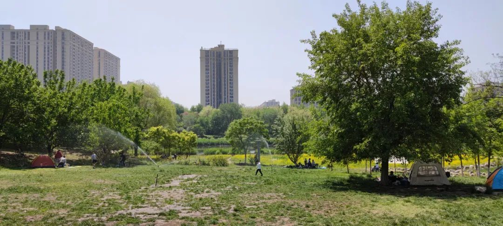
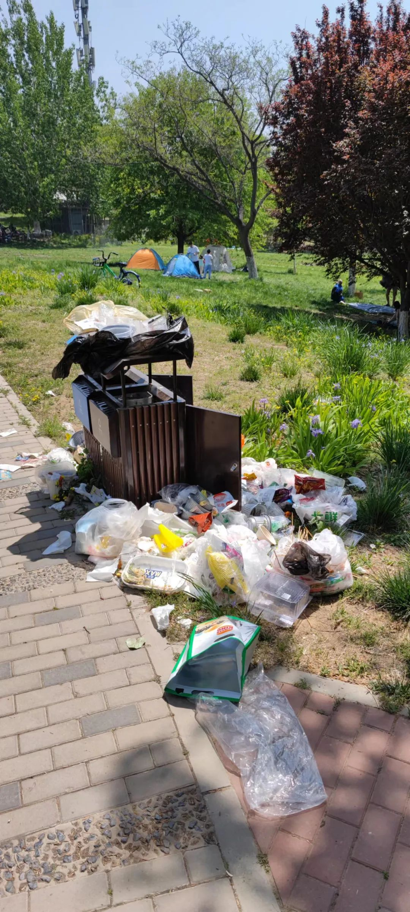
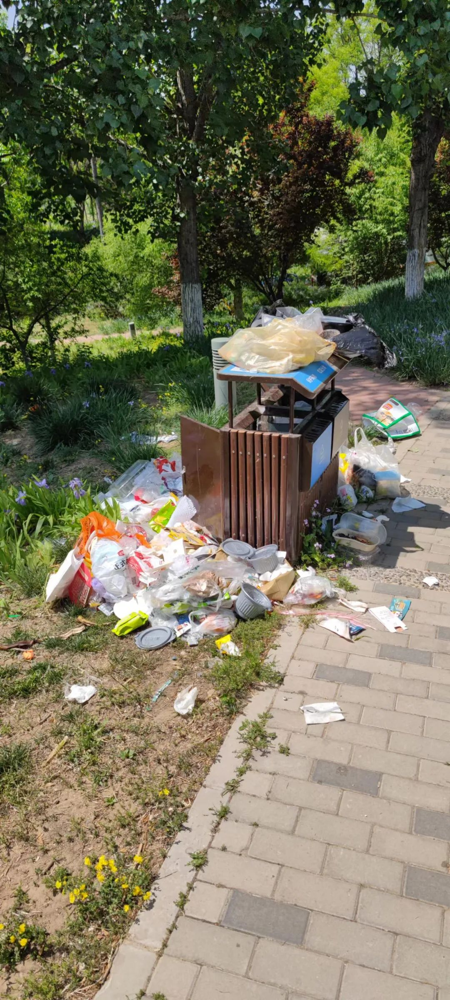
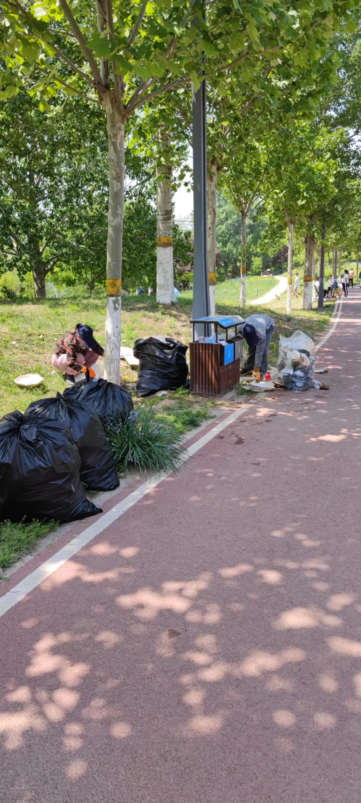
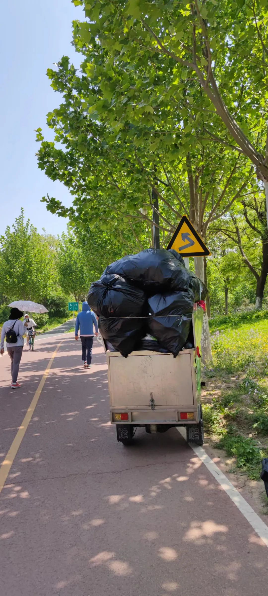

五一假期第四天，还有一天，假期就要结束了。假期开始没有兴奋，假期结束没有沮丧，生活俨然就是一杯白开水啊。

昨天没有记录，也是因为过于平淡，让我自己都感到倦怠。简要补写一下吧。早上在小区做了核酸，出入卡继红色、蓝色之后，换成了黄色。好奇会不会把颜色谱系都轮换一遍，如果是为了让小区检查人员加以区分，对他们的色差辨别能力还是要求蛮高的呀。上午去京客隆买菜，比较放心，物资充足，不用囤货，不用恐慌。回来玩了几局游戏，看了一部老电影。《新龙门客栈》不愧是武侠经典，即使看过好几遍了，重温依然经典。所谓经典，大概就是百看不厌吧。下午阅读《世界观》第24章“广义相对论”。果然，牛顿的核心观点受到了挑战，而且根据实证研究，世界的真相更倾向于广义相对论，我们从小就建立起来的牢不可破的“重力”概念很可能是错的。晚上把放了好久的花生剥了壳，炒了一盘花生米，本来想喝着啤酒吃花生米，突然意识到没有啤酒，最后泡了一杯红茶，就着吃了半盘。没有出去散步。记录完毕。

早7:20起床。阅读书虫4级《克兰弗德（Cranford）》第1、2章。顺带说一句，这是我践行SSS英语学习法的一部分。所谓SSS英语学习法，即Start with Simple Stories，通过简单的故事开始学习英语，以兴趣为导向的进行大量阅读来提高语言使用能力，并真正享受到英语阅读的快乐。我认为这是实用主义上班族学习英语的最好方法，找一个跟自己英语水平匹配的英文小说系列，以兴趣为主，大量阅读就是了。我的诉求是可以直接看英文资料和英文小说，跟考试无关，所以SSS学习法最适合我。

吃完早饭，去滨河公园散步，惊讶地发现，公园已经被北京市民给占领了——漫山遍野的帐篷。居民们不能远行，干脆把公园当成了宿营地，开始了联欢。基本上以家庭为单位，一个个帐篷依次排开，顺着凉水河，沿着斜草坡，躲在树荫下，种类多姿多彩，争奇斗艳。有豪华型的，像个小城堡，甚至能分出个两室一厅，上面搭着宽大的遮阳布，气质非凡；有普通型的，像一个个的蒙古包，中规中矩，占了大多数；有简约型的，直接扯上一片布，绑在树干上，下面摆上几个折叠凳；还有卡通型的，是儿童专用，规模很小，但样子别致，小朋友自己的城堡。一旦有了自己的独立王国，能搬的都搬过来，熊孩子，狗娃子，简易的桌子，折叠的凳子，吃饭的家伙式，成箱的啤酒饮料，还有吃饱了喝足了能够炫耀两手的乐器。大人们坐在帐篷边上吃东西，打牌，唠嗑；人类幼崽们撒了欢儿地在树林里穿梭，摆弄摆弄他们的玩具，追一阵同样兴奋的人类的好朋友。

真是一派祥和欢乐的画面啊！

但是，没走多久，我就看到这样的画面：

这只是滨河公园里几十个垃圾桶中的一个，其它垃圾桶基本上也是同样的命运。我们再看看环卫工人是如何为了这份祥和欢乐的气氛默默付出的：

这一个垃圾桶就装了5大包。请记住，我拍照的时候还是中午，这一天还没完哦，我们树林里的居民朋友们还在尽情地欢声笑语，吃着各种美食，喝着啤酒饮料。

因为是在公园里，大型垃圾车进不来，只能是这种小三轮运送垃圾。你可以想一下，这两个环卫工人要运送多少趟才能把今天丢弃在公园里的垃圾给处理完？

人类啊，人类！你刚刚讴歌他的崇高与伟大，他反手就给你一记耳光。

在不受约束的环境下，人性的残酷和贪婪超出我们的想象。记得若干年前，看柏杨的文集，好多内容今天都忘记了，但唯独一句话念念不忘：绝对的权力产生绝对的腐败。年轻的时候对这句话还将信将疑：一个有理想、有道德、正直、善良的大好青年，难道走上了权力的巅峰，就一定会堕落腐化吗？他的道德自律何在呢？他的精神家园何在呢？我不相信一个有道德自律的人会因为权力而沦为禽兽！

但是人到中年，我差不多相信这句话了。道德自律无法完成人类向更高层次进化的使命，最多只能成就个别人类——那些称之为圣贤的人。对于普罗大众，道德自律只是文明的一件外衣，随时都有脱掉的可能。有些人可能会说，你太夸张了吧？不就是随手仍一下垃圾吗，至于上升到人性和道德的层面吗？不，并不是夸张。在稍微失去约束的环境下，人们会随手丢弃垃圾，给他人造成不便；在彻底失去约束的环境下，人们就会杀人放火，危及他人的生命。看看俄乌战争中发生的事件，还不够说明问题吗？屠杀平民，屠杀战俘，惨绝人寰，严重违背道德底线。难道这些人都是恶魔吗？他们在和平有秩序的环境下，就是守法的公民；他们在战争无秩序的环境下，就是恶魔。是他们之罪，还是人类之罪？我们对人类的道德自律还有信心吗？

权力受到约束，才不会滥用；自由受到约束，才不会放纵。人们常说要追求自由，但自由的另一面是责任。只有自由，而没有责任，人就会走向放纵堕落的深渊。假期中休闲娱乐是我们的自由，我们应该有去公园游玩的自由，我们应该有欢声笑语享受美食的自由，但相应地我们也应该有保护公园环境的责任，有吃完东西后把垃圾打包带走妥善处理的责任，有不损害他人正常生活权力的责任。而这个责任，靠普遍的道德自律恐怕是做不到的，需要约束，需要监督。

生命诚可贵，
自由价更高。
若为两者故，
责任肩上挑。

因为阅读小说《克兰弗德》，进一步发现了同名电视剧《克兰弗德》（第一季），BBC出品。晚上看了两集，精彩至极，可以跟小说同步观看。英国人那种老牌的绅士做派和对规矩的讲求，在这部作品得到了充分的体现。这个故事的背景是1842年，英国在这个时候刚刚通过第一次鸦片战争撬开了中国的大门，随之而来的是中国惊天动地的变局，这片土地上发生了翻天覆地的变化。而英国国内的变革也是不均衡的，有些地方变革的快，有些地方变革的慢，克兰弗德这个小镇正是那种抵抗到最后、固守自己的传统风俗和习惯的地方。不过大时代的冲击任何人也挡不住，生活在其中的人们势必要经历思想上和习惯上的阵痛，社会的巨大变迁需要一代人付出代价，她们的命运并不能由自己掌控。这部作品还有个独特之处，它是以女性为主体，以女性为主要视角展开的，在当时的社会背景下也是很有意思的。