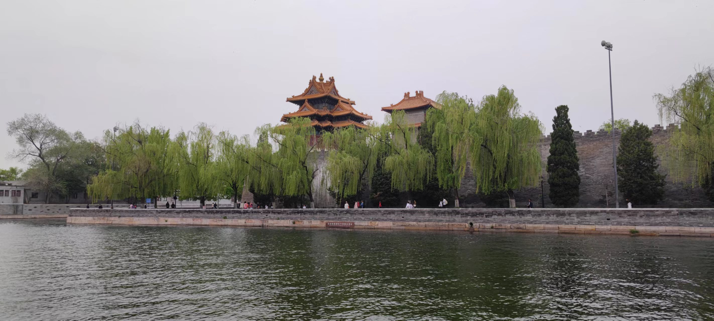
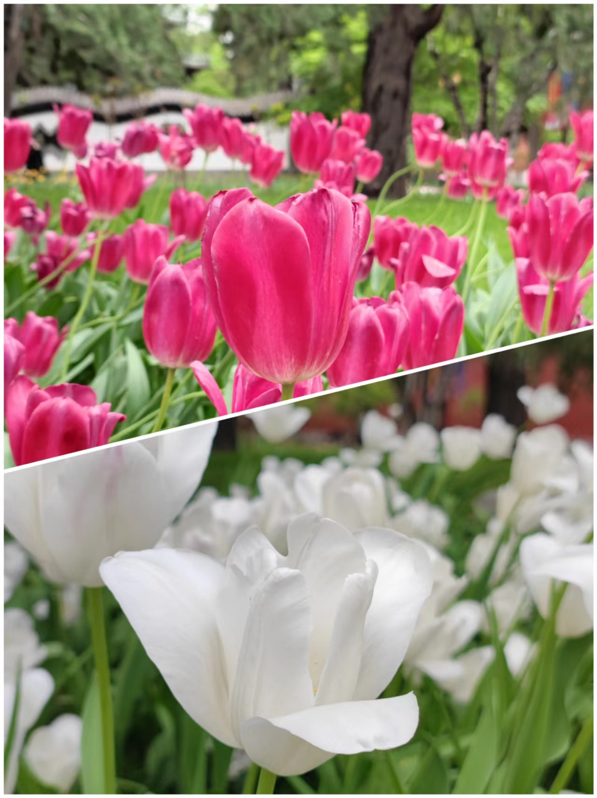
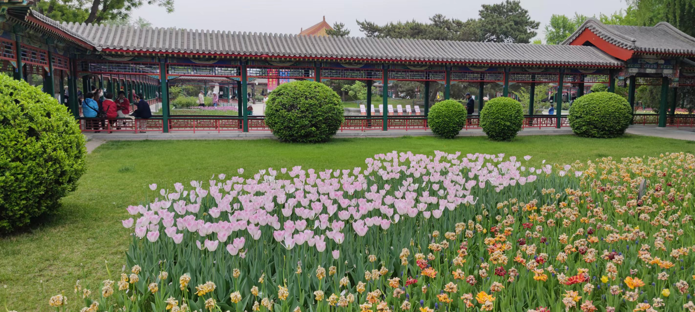
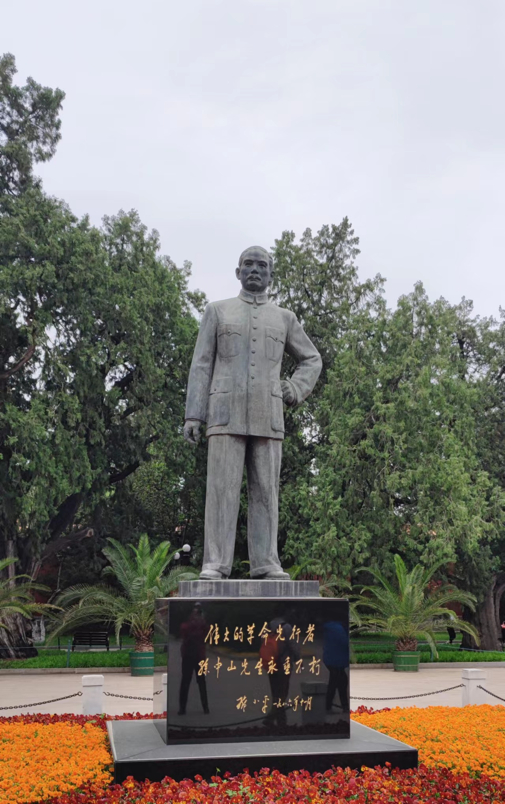
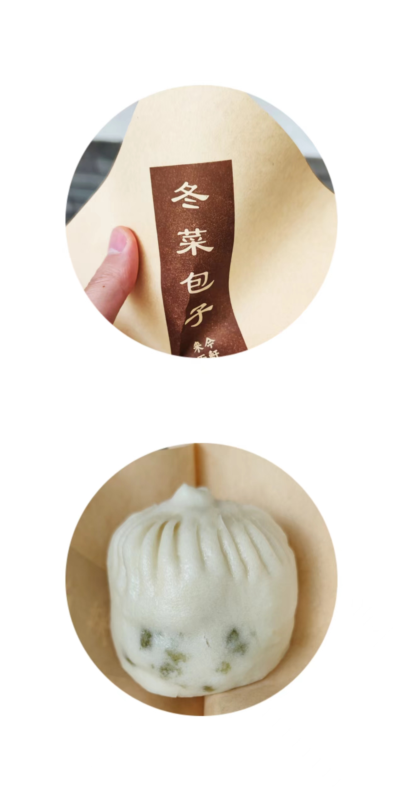
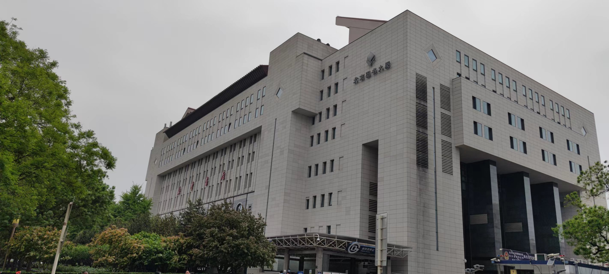
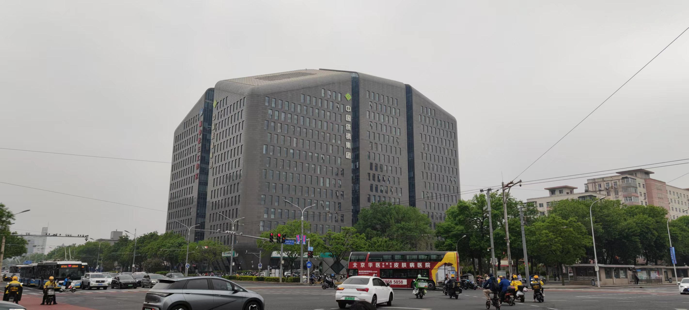
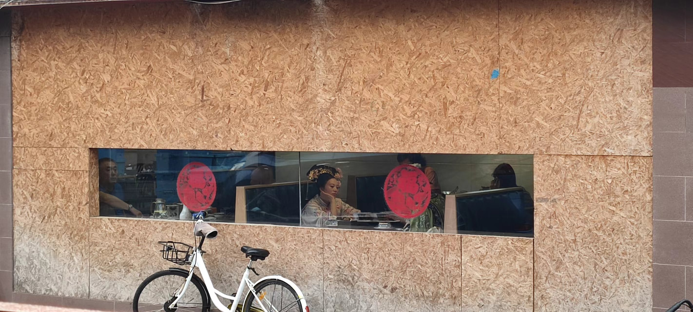
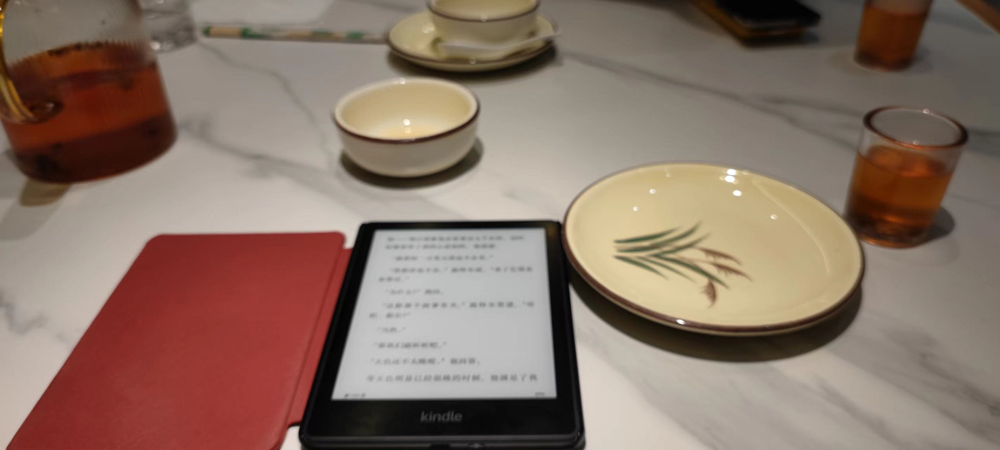
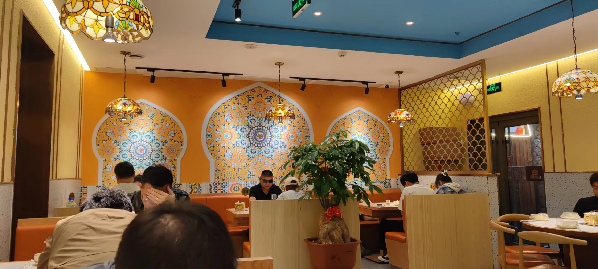

周六闲来无事，约欢哥一起逛中山公园。

约好的上午十点在公园西门碰面，但我疏忽了中山公园位置的特殊性，早上按照地图上的计划行程出门坐地铁，结果出站时就开始排队安检，出站后立马又是一次安检，去中山公园西门的途中又遇到了一次安检，等到了西门跟欢哥汇合时，已经是上午十点二十分了。

欢哥为人宽厚大度，对于我的姗姗来迟似乎也在意料之中，一笑置之。我们俩经过公园门口的最后一次安检，终于踏进了中山公园的神圣疆域。

这个季节，中山公园的最大看点就是郁金香。红的、白的、黄的、紫色、蓝的、粉的，各种颜色的郁金香争奇斗艳，尽显芬芳。

我最喜欢的是这种粉色的郁金香。远远望去，像一片轻盈的云漂浮在绿洲之上，飘逸空灵，宛若仙境；慢慢走近看，粉嫩皎洁的花瓣一点点明晰起来，上面颜色的层次感逐渐分明，像荷花，像灯盏，像翡翠，动人心弦。

我跟欢哥一边闲聊，一边漫无目的地沿着花丛中的小径漫步。遇到令人心醉的郁金香，驻足欣赏一下，同时也关注一下花边的游客，其中不乏优雅动人、容貌姣好的女子。春天的季节，鲜花醉人，人也自醉。

走到中山先生的雕像前，我才明白中山公园的由来。1925年孙中山先生逝世，在园内停放灵柩，举行公祭。为纪念这位伟大的民主革命先驱，1928年将此处改名为中山公园。

公园不大，没花太长的工夫，我们就逛完了一圈，又逛了一圈，反过来又逛了一圈。三圈下来，娇艳的郁金香已经渐渐褪色，美丽可爱的小姐姐们也慢慢远去。我跟欢哥开始跨越物质的羁绊，进入了精神世界的殿堂。

关于人生和意义，关于成长和未来，这些话题天然地比一时盛开的郁金香更能吸引人们长久探索和讨论的欲望。

欢哥并不是很健谈的人，很多时候一笑而过，但往往是这样的人，有着对生活和人生独特的见解和领悟，一旦进入到他们感兴趣的领域，便能给出真知灼见。

逛完了三圈，聊了一些有趣而深刻的话题，我跟欢哥都有些饿了。

记得在逛第一圈的时候，路过一栋建筑，题名为“来今雨轩”，吸引我们是建筑一角排起的长长队伍，我们以为是什么有趣的活动，走近了一看，却是在排队买包子，我跟欢哥只好无奈一笑地走开了。

现在肚子闹意见，自然就会想起那个长长的队伍，想起那个始作俑者的包子，想来那包子应该是独具匠心吧，不然为什么大家愿意排起长长的队伍呢。

于是我跟欢哥又回转来到“来今雨轩”，每人买了两个包子。包子只有一种——冬菜包子，八元一个。也许是饿了的缘故，这些包子看起来很有食欲，吃起来很是美味。如果来到此地，恰好感到饿了，还是值得尝一尝的。

从上午十点半进来，到下午一点左右，大约逛了两个半小时。我跟欢哥一致认为公园里的郁金香、小姐姐和包子已经失去了迷人的魅力，于是决定出来沿着长安街溜达溜达。

我们从中山公园出来，沿着长安街向西漫步。看着长安街上的车流往来，我心中油然升起一种崇高浪漫的情怀，说不清楚它从何而来，也说不清楚它因何而起，但走在祖国最核心最著名的街道上，毫无疑问激发了内心深处的这种情怀。

走到西单，在北京图书大厦我们停住了脚步。谢天谢地，终于找到共享单车了！

我们之前走过来的区域内，是看不到共享单车的。故宫天安门附近的区域是不允许停放共享单车的，可以骑进这个区域，但不能半路下车。

按照我们的计划，上午是逛中山公园，下午的是享受美食。有了共享单车，我们就可以开始下午的美食之旅了。

欢哥是美食收藏达人，每次跟他一起京城一日游都不用担心吃饭的问题，因为在欢哥的手机上，总是会列出一份美食清单供选择。

我们在路边稍停片刻，欢哥就定位到一家新疆特色的美食，距离四公里左右，骑单车刚刚好。

在二环以内的老城区骑行，别有一番韵味，让人流连忘返。刚才的街区还是现代化的辉煌建筑和六车道的宽阔大街，下一个街区就是古香古色历史遗迹和纵横交错狭窄逼仄的北京胡同。恢宏与破败，整洁与混沌，嘈杂与冷清，在这里不期而遇，浑然一体。

在这里骑行，就如同在历史中穿行，充满刺激和新奇。

骑行了大概半个小时，终于抵达了目的地。但很不凑巧，已经过了下午两点，错过了饭馆中午的营业时间。想要在此就餐，只能等到晚上的饭点，还有两个多小时。

我跟欢哥有些犹豫，考虑是不是要换一家，刚好这时飘起了小雨，我们就暂时坐在饭馆门前的屋檐下，一边欣赏着淅淅沥沥的雨丝，一边谈论着有什么可选的美食。

一个少年从屋里走出来，服务生的打扮，看着年龄不会超过十七八，手里端着一个不锈钢圆碗，里面盛着看起来很香的饭菜。

他很轻盈小心地从我们面前走过，坐在两米外供客人临时休息的塑料凳子上，吃了几口，便把饭碗放在旁边的凳子上，从兜里掏出香烟，很友好地向我们打个招呼，问我们是不是抽烟。

我跟欢哥都不抽烟，感谢过他的好意，我们开始攀谈起来。

他来自河北邢台，今年十六岁，刚来这里一个月。没有人带他出来，只身来到北京，在这家饭馆找到了一份服务生的工作，什么活都干，买菜、搬东西、点菜、上菜、收拾卫生、门口招揽顾客，一个月四千五，包吃住。

他说自己留一千五花销，剩下的钱打给爸妈。他说自己并不满足于此，他的梦想是走遍天下，并不想在一个地方呆太久。他说准备再干上两个月，就到南方广州去，他的舅舅在那里，但他并不想投靠舅舅，还是会自己找活干。他说等锻炼锻炼，将来自己想当饭店老板。

我很惊讶，一个十六岁的少年，没有同龄人身上的青涩和害羞，很老练悠闲地抽着烟，跟我们侃侃而谈，好像我们是他多年的朋友。

雨越下越大，我们想换一家也走不了了。外面屋檐下已无法容身，我们进到饭馆内，找了一个位置好的饭桌，舒服地坐下来，准备等着晚上的开饭时间。

少年跟我们侃侃而谈之后，这会儿也进入里屋休息去了，好为晚上的忙碌积蓄精力。饭厅里除了我们两个人，斜对的角落里还坐着一对儿年轻恋人，离我们挺远，埋着头在窃窃私语。

饭点时人声鼎沸的喧嚣已经消散于外面的风雨中，这时的饭厅里像图书馆一样安静，只能听到外面淅淅沥沥的雨声。

我跟欢哥也不再交谈，看着各自的小说。我出门时带了Kindle，刚好这个时候派上了用场。我这两天正阅读毛姆的南太平洋故事集《叶之震颤》，这一个小时差不多可以让我看完一部短篇了。

四点半开始营业，四点十分左右开始陆陆续续上人，快到营业点时大厅里已经坐满了客人。人声再一次鼎沸，喧嚣再一次回归，欢乐热闹的时光再一次降临。

享受美食让人快乐无比。我跟欢哥也是万事俱备只等餐来，因为确实饿坏了，中间只吃了两个小包子，到现在已经是饥肠辘辘。这顿饭就吃的特别香，以至于差不多吃完了，才想起来还没给招牌菜拍一张靓照。

吃完饭，我们各自打道回府，相约有空再聚。