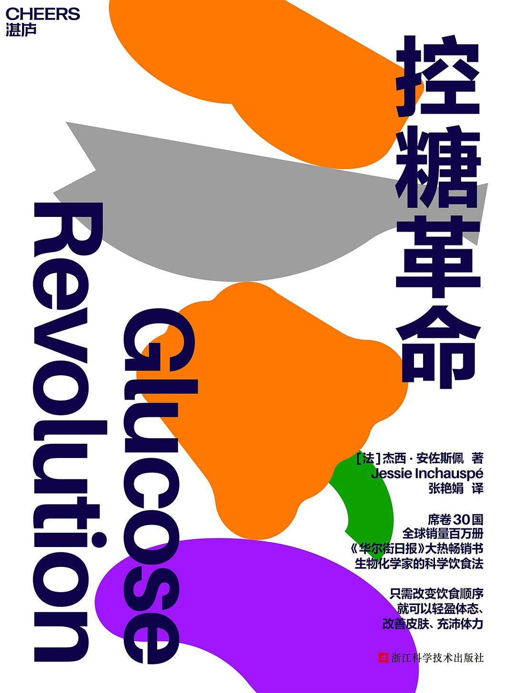
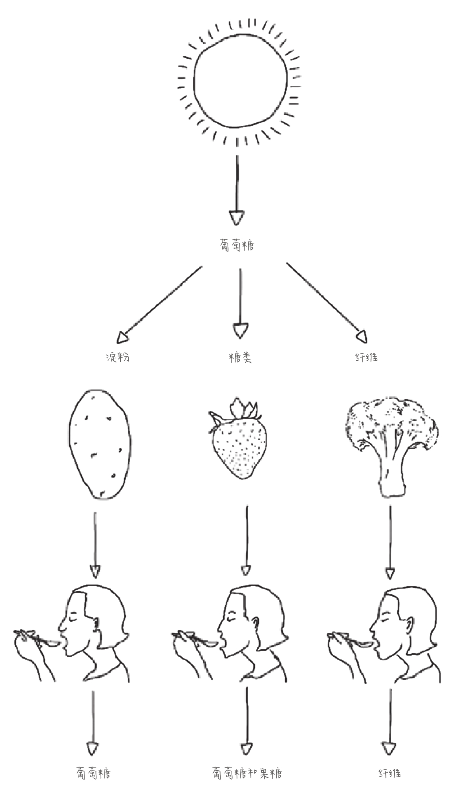

《控糖革命》这本书推荐给关注自身和家人健康的朋友们。

这本书的主题是如何控制血糖，使血糖曲线趋于平稳，避免出现大起大落的峰值和低谷。

前半部分主要讲原理：葡萄糖在自然界是如何生成的，葡萄糖在各种食物中的表现形式是什么，葡萄糖是如何进入人体并影响身体机能的，高血糖的危害究竟是什么。

后半部分主要讲技巧：通过轻松控糖的10个小窍门，如何快速有效地控制血糖，使血糖曲线尽量保持平稳。

我为什么关注血糖，并阅读相关的书籍，是因为我自身已经深受其扰。

之前连续两年，我体检的血糖指标都达到了临界值6.1，这让我不得不慎重对待血糖对自身健康的影响了。

虽然从两年前开始，我已经开始注意饮食，少吃含糖高的食物，减少主食，减少含糖量高的水果，尽量不吃甜的零食。

但基本还是凭着感觉走，也许有点效果，但并不明显，我平时的精神状态没有多少好转。早起时常感觉昏昏沉沉，上班没有精神，容易疲劳，一天下来精疲力尽。

我隐隐感觉是跟血糖不稳定有关系，但什么关系，应该怎么办，没有任何头绪。

于是决定系统了解一下血糖运作的原理和控糖的方法，就在网上搜索，无意中看到有人推荐这本书。看书名很对路，就找来看了看，并决定实践一下，看看是否有效果。

这种验证立竿见影，不需要太长时间就能看到效果。因为血糖和血压一样，一旦指标异常，身体很快能感觉到；而一旦血糖曲线正常平稳，身体很快就感觉到轻松，精神状态变好。

我从书里介绍的控糖10个小窍门里，结合自身的特点，选了几个自己容易做到的，开始实验。

验证的效果很明显，用了这些方法两三天后，我的身体和精神状态就发生了变化，早起不再那么昏昏沉沉，疲劳感明显减轻，上班精力也更加充沛，之前由血糖过山车造成的大脑迷雾现象也少了很多。

人到中年，这些问题已经在所难免。高血压、高血糖、高血脂，中老年人的慢性杀手，也许每个人不知不觉中都会被击中，逃也逃不掉。

我们要做的，是用科学的知识武装自己和家人，用冷静客观的头脑去面对，慢慢打一场持久战。

为了自己和家人，我会不断地学习健康方面的科学知识，并结合自身的特点，加以实践应用，争取让这场关于衰老的持久战持续更长久一些。

也希望有相同困扰的朋友们尽快行动起来，了解自己的身体，掌控自己的身体，更好地面对生活的挑战。