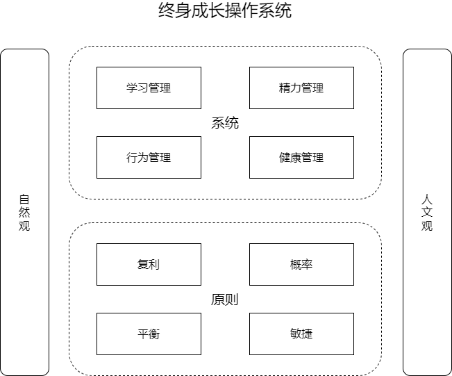
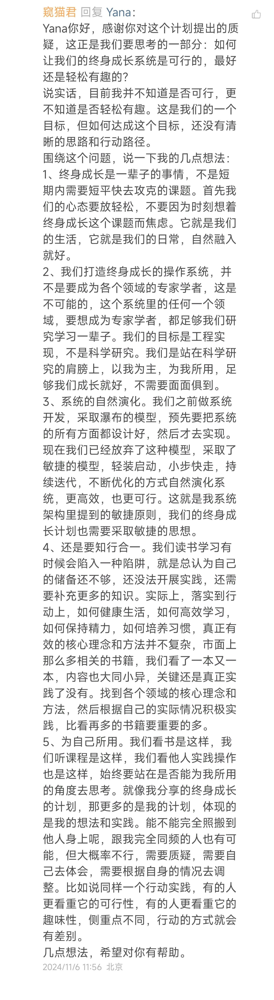

最近弄了一个星球在玩，分享一些关于终身成长的杂七杂八，主要还是想结合自身的成长体验沉淀一些内容。

目标是打造一个终身成长的操作系统，大概的思路如下：

一、两翼

1、自然观

培养科学思维，运用科学工具，认识真实世界

道法自然，抒发天性，感受自然之美

2、人文观

培养主体精神，提高人文修养，探寻内心力量

自强不息，厚德载物，传承优秀文化。

二、原则

1、复利

长期主义+叠加效应

做时间的朋友

惟精惟一

2、概率

世界的不确定性

任何事情的发生都是一种概率，没有必然的事情

在大概率成功的事情上努力

在小概率“毁灭性”事情上防范

谋事在人，成事在天

3、平衡

自然界的基本法则：阴阳互动，张弛有序

效能的本质：产能与产出的平衡

只注重产能，不注重产出，最后自己会饿死

只注重产出，不注重产能，最后自己会累死

4、敏捷

最小启动

小步快走

重视沟通

尽早发布

不断更新

三、系统

1、学习管理

学习能力，是终身成长的油箱，不会学习，我们就缺少前进的资源

研究如何高效学习的原理和方法

2、精力管理

充沛精力，是终身成长的发动机，没有精力，我们就缺少前进的动力

研究如何保持充沛精力的原理和方法

3、行为管理

行动实践，是终身成长的车轮，没有行动，我们就只能在原地踏步

研究如何把学习到的知识转化为行动，并最终形成习惯

4、健康管理

身体健康，是终身成长的底座，没有好的身体，前面的一切都是浮云

研究导致疾病和衰老的机制，运用科学的研究和成果，如何有效预防疾病和延缓衰老

这个计划在星球发布后，一位星友提出了一个问题：这个计划是否可行？以及是否可以轻松有趣？

我想，这个问题，应该也是很多刚看到这个终身成长计划的朋友们想问的。

说实话，我并不知道是否可行，更不知道是否可以轻松有趣，但我有一些真实的想法，分享给了这位星友。现在也一同分享给大家，可以斟酌参考。

仁者见仁，智者见智，君子和而不同。对同一件事情，有不同的看法和见解，再正常不过。

关键是我们的目标是否一致：努力成为一名终身成长者。只要目标相同，我们就可以风雨无阻、一路同行。

至于这个计划能不能实现，最终能交付什么？眼下我也不知道，先做做看。

不去耕种，总不会有任何收获；耕种了，大概率会有收获，但还有一部分要看天意。
