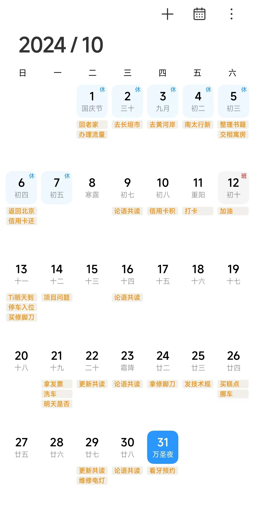

参加工作以来，我实践过很多关于任务和时间管理的方法和工具，像RTM、Doit.im、奇妙清单、滴答清单、微软待办、印象笔记清单等等。

但一个也没能坚持下来。少则几周，多则几个月，就心理抗拒、不想再使用。为此我曾非常懊恼，深深自责，产生过强烈的挫败感，一度认为自己无可救药、自制力太差。

特别是那个大名鼎鼎的GTD方法，我捡起来一次就败给它一次，无数次的斗志昂扬，又无数次的铩羽而归。最后我只能认定自己资质平庸，学不会这项绝世武功。

后来，我逐渐了解到许多人跟我一样，也是尝试了很多高大上的任务和时间管理工具，但能够坚持下来的凤毛麟角。我心有慰藉，自信心才回血了那么一点点。

最近几年，我已经懒得折腾这些七七八八的方法和工具了，直接用手机上自带的日历软件，处理工作和生活中的各项杂事。

不知不觉中，一直用到现在，用起来还挺顺手。果然，任何事物，适合自己的才是最好的，不管看起来是不是高大上。

这种方法适合管理生活中的杂事，特别是适合像我这样记忆力比较差、比较健忘的人。

下面是我10月份的日历。上面的任务提醒，大部分都是一次性的提醒事务，比如信用卡积分兑换、加油、洗车、维修点灯、看牙预约等等；有些是周期性的事务，比如每月6日的信用卡还款日、每周三晚上20:30的《论语》共读会。

这个方法的要点是：

1. 脑子里一旦闪现一件具体要做的事情，立即拿出手机，打开手机日历，创建一个日程。这件事就排到了日程中，不用在脑子里一直想着它了。只等手机日历到点提醒，去执行就行了。

2. 如果这件事情你不知道怎么写，或者你不能确定具体执行的时间点，很有可能是这个事情还不够具体和明确，需要你进行细化分解，分解成具体可操作的任务，然后再添加到日程中。

3. 日历一旦提醒，没有特别紧要的事情，就要立即去做。行动力很重要！如果行动力跟不上，再简单实用的时间管理方法都没有用。

4. 如果一项日程提醒了，万一被其它事情耽搁住了不能开始，也不用纠结，点开这个日程调整一下时间点，重新排入日程即可。

我举一个10月份日历中的实际例子：看牙预约。

周六上午，我发现左边大牙里面的智齿有所发展，开始磨口腔的内壁，已经对我的生活造成了困扰，必须要干预处理了。

1. 我立即拿出手机，点开日历，考虑一下合适的时间，创建一个周三下午14:55（因为同仁医院南区的网上预约时间是下午15:00）的日历提醒：“看牙预约”。

2. 到了周三下午14:55，日历提醒我该预约看牙了，我就立即放下手头的工作，打开同仁医院的公众号，开始口腔科的预约。很遗憾，没有预约上，预约的号码瞬间就被抢完了。

3. 没办法，只好周四再尝试预约。我点开“看牙预约”的日历提醒，修改提醒时间为周四下午14:55，重新排入日程。

4. 如果周四下午准备开始预约的时候，刚好领导叫我去开会，那也没办法，只能再调整日历提醒时间，重新排入日程。

5. 直到看牙预约成功，这项日程就算结束了。

就是这样，非常简单！

这种方法适合工作的场景吗？

生活中的事务侧重于提醒，通常比较简单、易操作，重点是提醒我们不要忘记。

工作中的事务侧重于分析、规划、按计划实施，每一个步骤的事务基本都在工作计划之中，想忘记也不容易啊。即使你忘记了，你的领导也会帮你想起来的。只不过如果你经常忘记工作事务的话，你的领导对你就没那么客气了。

所以，日历提醒在工作场景中只是辅助工具，一些重要的工作节点或者临时性的任务可以设置提醒，在工作计划之中的事务就没有必要设置日历提醒了。

从我10月份的日历上，也可以看到这一点，基本上都是生活中的一些事务，工作上的事务非常少。

这就是我日常生活中使用的时间管理方法，足够简单，也足够有效，希望对您有所启发。