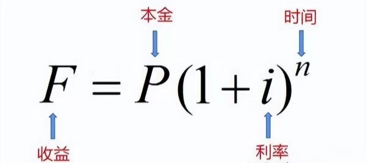
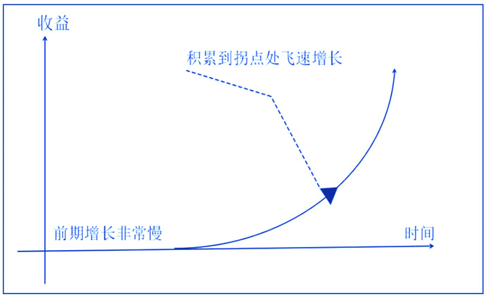

复利是终身成长最为关键的一项原则，然而，其思想与原理却相当简洁。

我们首先看一下它原始的定义：

**复利是指在计算利息时，将前一期的利息加入本金，然后再计算下一期利息的一种计息方式。简单来说，就是利滚利”。**

例如，你把一笔资金存入银行，银行除了会根据本金支付你利息外，还会把利息也计入下一次计算利息的本金范围，这样随着时间的推移，你的收益会越来越多。

用数学方法来表述复利原则，会更加简洁明了，其数学计算公式如下：

* F是终值，也就是最终的本利和
* P是初始本金
* i是增长利率，例如5%
* n是期数，例如存款的年数

例如，你存入本金1000元，年利率是5%（i=0.05），存期3年（n = 3），那么根据公式计算可得：

F = 1000×(1 + 0.05)^3 = 1000×1.157625≈1157.63元，这里的利息部分为1157.63 - 1000 = 157.63元。

如果是单利计算（只以初始本金计算利息），利息则为1000×0.05×3 = 150元。由此可见，复利比单利能获得更多的收益。

从复利的定义中，我们就能提取出来复利原则的两个核心要素：

1. 时间的价值

复利强调时间的重要性。在复利的作用下，即使是很小的利率，经过较长时间的积累，也能产生巨大的增长。

而且时间越长，增加的速度越快，增长曲线呈指数级上升。

2. 持续稳定的增长

复利需要有一个持续稳定的增长率才能发挥其最大的威力。持续稳定的增长是复利发挥最大效力的关键。

长期做一件事情，不是机械的重复，而是保持一个持续稳定的增长率。这个增长率可以很小，但在时间的加持下，就可以产生神奇的效果。

上图曲线呈现出一种典型的复利增长模式：

* 前期增长缓慢：在曲线的起始阶段，增长非常缓慢。这反映了复利在初期由于本金较少，收益增长不明显的特点。例如，在投资初期，即使有一定的回报率，但由于本金不多，收益的绝对值增长较小。
* 积累到拐点处飞速增长：随着时间的推移，曲线在某一点（拐点）之后开始呈现出快速上升的趋势。这是复利的核心特点之一，即经过一段时间的积累，收益会在某一时刻开始迅速增长。这就像在投资中，随着本金和利息的不断累积，后期的收益增长会越来越快。