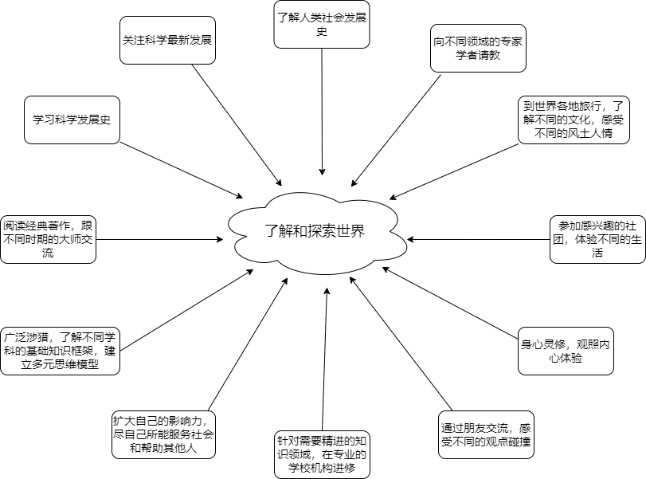
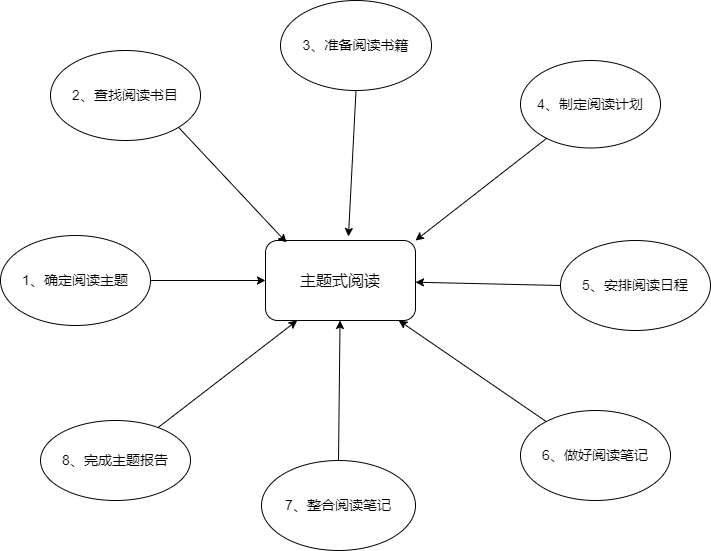
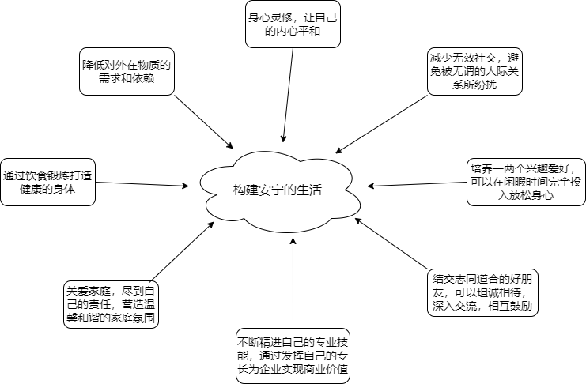
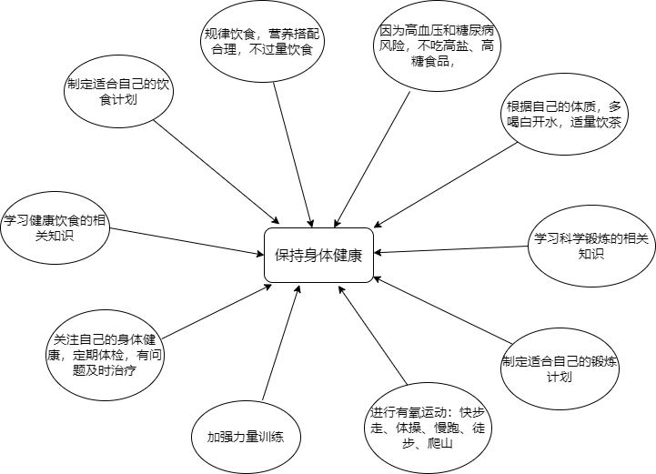

有了生活的愿望，就可以开始探索实现愿望的行为选项了。

我在上一篇中说了我的一个愿望：我希望尽可能多了解和探索这个世界。针对这个愿望，我应该如何探索实现它的行为选项呢？

斯坦福大学的福格教授在他的著作《福格行为模型》中介绍了一种探索行为选项的方法：行为集群。这个方法非常简单，就是在一张白纸上画一朵云，把你的愿望填进去，然后在云朵的周围画出一个又一个文本框，把你能够想到的可能实现愿望的行为选项都列出来。

以我上面的愿望为例，效果是酱紫：

福格教授特别强调，在列出行为选项时不用考虑可行性，尽可以发挥想象力，能列多少是多少。但人们通常还是习惯性地考虑可行性，把一些明显不切实际的行为选项过滤掉。我这里列出的行为选项也只是一部分，是我认为更重要更具可行性的一些行为选项。

然而，这些行为选项还是太抽象，不具备可操作性，需要进一步的细化。我们可以把“行为集群”的方法进行递归，把抽象的行为选项再次具体展开。

比如针对“阅读经典著作”、“学习科学发展史”、“关注科学最新发展”、“了解人类社会发展史”、“涉猎不同的学科”等抽象的行为选项，可以落实到“主题式阅读”行为选项上。“主题式阅读”按照行为集群的方法展开如下：

主题式阅读：

1、确定阅读主题

阅读主题通常是我们感兴趣的一个问题，比如“如何养成一个新习惯”就可作为一个阅读主题。

2、查找阅读书目

根据阅读主题查找相关的阅读书目。

3、准备阅读书籍

选定阅读书籍，根据自身情况购买纸质书或电子书。

4、制定阅读计划

制定粗略的阅读计划，评估本次主题阅读需要的大概时间。

5、安排阅读日程

安排阅读日程，把阅读行为合理安排到日常的生活日程中，可以是固定日程，也可以是灵活日程。

6、做好阅读笔记

根据自己的情况做读书笔记，加工整理读书笔记，原则是灵活方便快捷。

7、整合阅读笔记

定期对读书笔记做阶段性整理，汇总、加工、整合，形成阶段性的输出物，等待进一步的汇总整合。

8、完成主题报告

完成主题阅读，根据之前的阶段性输出物和思考，形成最终的输出报告。

通过这样一步一步的细化，就可以逐渐把抽象的行为变成具体的行为，可操作可度量可实施。

再比如我的另一个愿望：我希望过一种相对安宁的生活。通过“行为集群”的方法探索如下：

同样，这些行为选项还是太抽象，需要进一步细化。比如针对“保持身体健康”这一项，又可以通过“行为集群”的方法列出要很多相对具体的行为选项：

实际上，上述的行为选项有些还是比较抽象，可以继续细化下去，直到可以立即上手操作为止。

当然，这里重点是介绍这种分析方法，至于具体的行为选项，每个人的愿望不同，行为方式不同，性格爱好不同，自然分解出来的行为选项也是千差万别的。

但思路是一致的，目的也是明确的：通过发散性思维，努力探索实现自己愿望的尽可能多的行为选项。至于这些行为选项在你的生活中是不是具体可行，暂时不用考虑，那是下一步骤要考虑的事情。