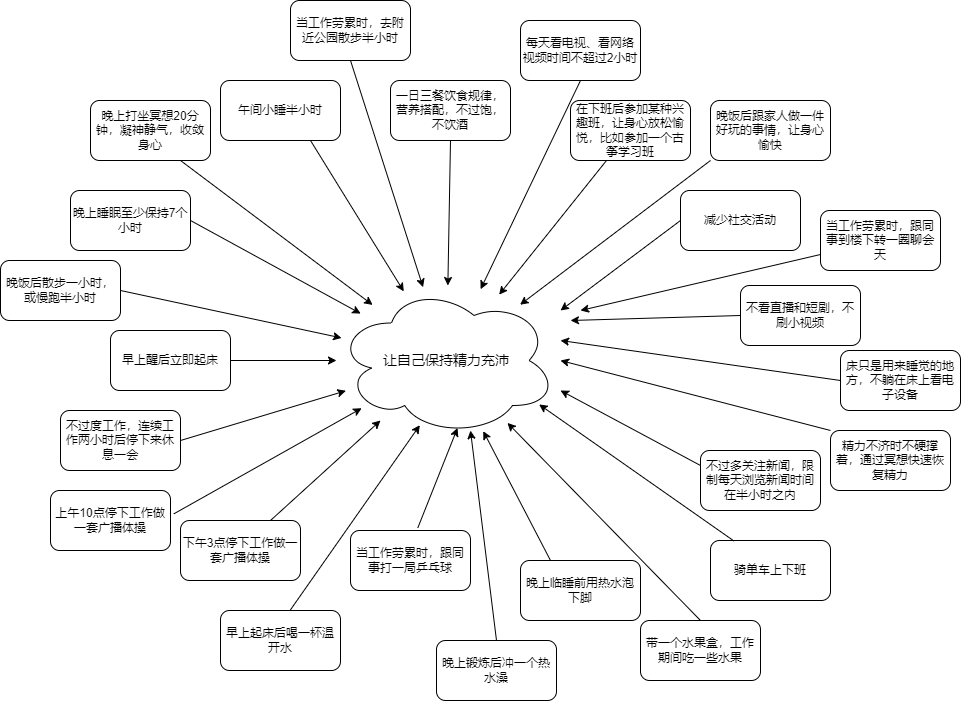
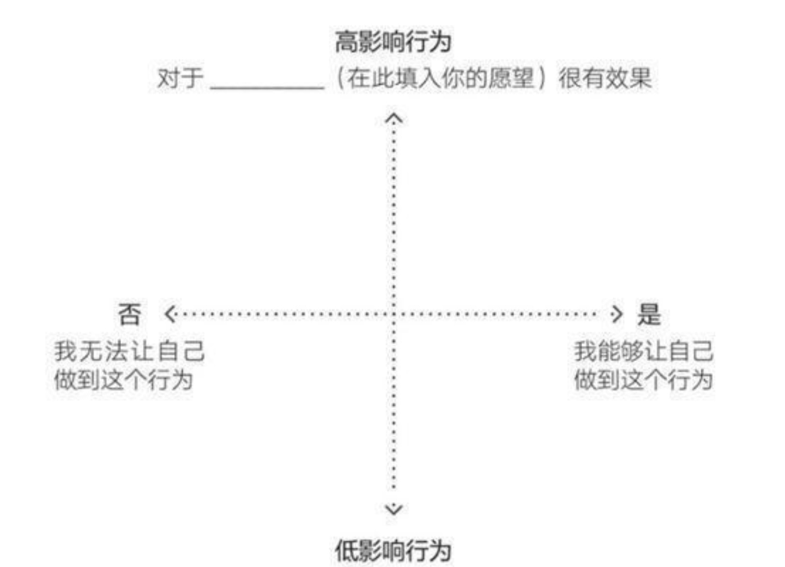
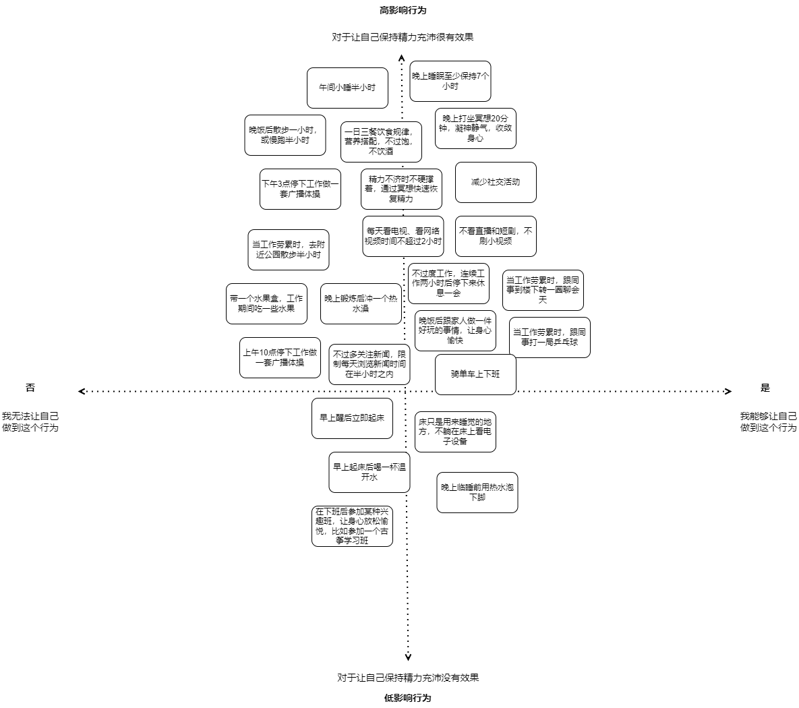
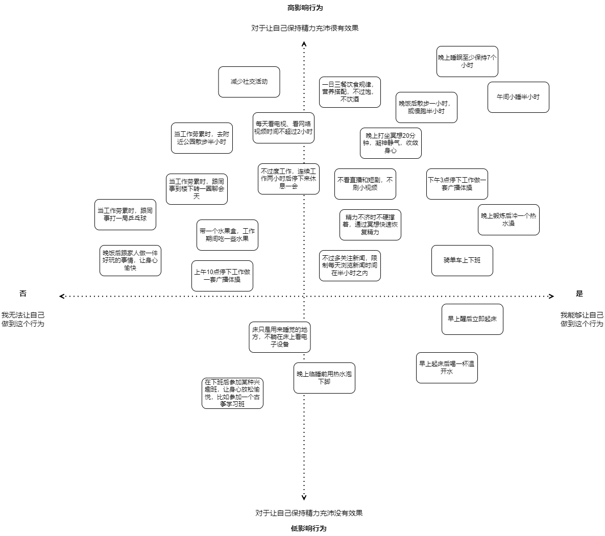

明确了愿望，就可以通过行为集群的方法探索实现愿望的行为选项。

但是行为选项只是一种可能，并不一定真正适合我们。

那么，如何才能在众多的行为选项中匹配到适合自己的具体行为呢？

福格教授提供了一个行之有效的行为匹配方法：焦点地图。

下面我们通过一个例子来展示一下如何应用“焦点地图”。

我的愿望：让自己保持精力充沛。

针对这个愿望的行为集群：

现在引入焦点地图：

我们可以看到，这是一个坐标系。纵轴代表行为的影响程度，越向上对实现愿望的影响越大，越向下影响越小；横轴代表行为的容易程度，越向右越容易做到，越向左越不容易做到。

我要做的就是把所有的行为选项放到这个坐标系中。根据影响程度和容易程度这两个维度，分成两个回合来完成。

第一回合：先不考虑容易程度，只考虑影响程度。把对实现愿望影响大的行为选项往上放，把影响小的往下放。

行为匹配第一回合成果如下：

第二回合：在第一回合的基础上，再考虑容易程度。把容易做到的行为选项往右平移，把不容易做到的往左平移。

行为匹配第二回合成果如下：

经过这样两个回合，我已经找到了适合自己的具体行为。右上角象限中的行为选项，即是对我的愿望影响比较大，也是容易做到的行为，也称之为“黄金行为”。

于是，针对我的愿望“让自己保持精力充沛”的黄金行为是：

1、晚上睡眠至少保持7小时。

2、一日三餐饮食规律，营养搭配，不过饱，不饮酒。

3、午间小睡半小时。

4、晚饭后散步一小时，或慢跑半小时。

5、晚上打坐冥想20分钟。

6、不看直播和短剧，不刷小视频。

7、下午3点停下工作做一套广播体操。

8、精力不济时不硬撑着，通过冥想快速恢复精力。

9、晚上锻炼后冲一个热水澡。

10、骑单车上下班。

接下来，是针对这些黄金行为进行设计，融入生活日程，变成我的习惯。