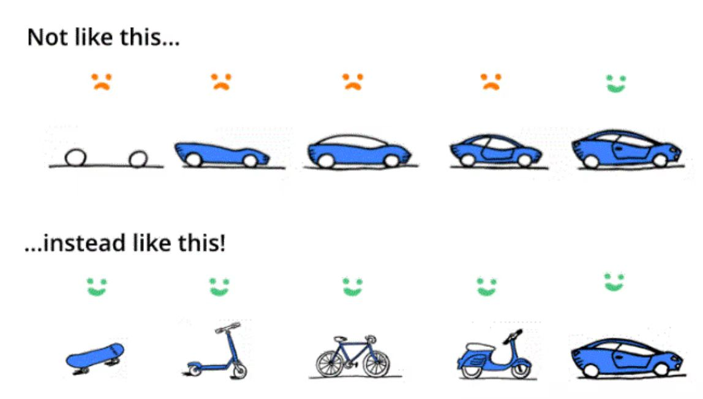

***千里之行，始于足下。——老子***

“轻装启动”包含两层含义：第一，现在就开始行动；第二，用最小的姿态开始行动。

当给别人介绍敏捷软件开发时，我最喜欢引用下面的示意图，它清晰地表达了在敏捷软件开发中是如何进行产品迭代的。

我们的愿望是给人们提供一种很棒的交通工具，解决他们的出行需求。

第一种思路：我们提供最完美的交通工具。为了实现这个目标，我们需要做详细缜密的计划和实施，大概需要三年的时间来完成。客户需要耐心等待，期盼着有朝一日能够开着梦想中的汽车在公路上飞驰，或者接受宣布研发失败的噩耗。

第二种思路：在能够提供给客户完美的交通工具之前，我们先提供简化方案。先从滑板开始，虽然比步行快不了多少，但客户起码有了一个极简版的交通工具，先试着玩玩呗。隔一段时间，当客户对滑板已经厌烦时，我们已经准备好了滑板车，客户又拥有了一段新鲜感。当客户对滑板车又心生嫌弃时，自行车、摩托车接踵而至，再一次满足了客户小小的虚荣心。好了，是时候拿出杀手锏了，我们最终推出了客户满意的交通工具。客户在这个过程中不需要焦虑地等待，他们一直在感受变化，而这种变化最终引导他们走向了梦想中的目标。

传统软件开发，通常采用第一种思路。经过漫长的需求分析和系统设计阶段，等一切准备就绪了，才开始一个组件一个组件的研发，最后把各个组件集成到一起，进行联调测试，测试通过发布产品。整个流程下来需要若干年的时间，而最终产品是不是能够满足客户和市场的需求，还存在未知的风险。

敏捷软件开发，通常采用第二种思路。快速了解客户的需求，以最小的姿态启动产品研发。第一个版本只满足客户最核心的需求，也可以称之为“产品原型”，然后就让客户开始试用。根据客户的试用反馈进一步收集需求，开始下一轮的产品迭代，或者改进之前的功能，或者增加新的特性。每一轮迭代的目标都是提供一个业务流程完整自洽的系统，虽然某些功能并不是非常完善，但总是可用，足以完成闭环操作。不断地跟客户沟通，不断地调整设计，不断地改进问题，不断地增加新特性，产品以一种最贴近市场和客户的方式在演化，最终发展壮大。

这是敏捷软件开发的思路！现在，让我们从软件切换到生活，这种思路是不是在生活中同样有效呢？

我之前已经通过“行为选项”和“行为匹配”的方法确定了一些“黄金行为”。我希望在生活中培养新习惯，比如工作日下午做广播体操的习惯、晚上外出锻炼的习惯、冥想的习惯、阅读的习惯等。

如何才能尽快培养起这些习惯呢？我准备采用“轻装启动”的思路开一个好头。

> 习惯一：工作日下午做广播体操的习惯
> * 时间锚点：工作日下午去卫生间（最后一个动作：洗手并使用纸巾擦干）后开始
> * 轻装启动：一个八拍广播体操
> * 每工作日下午去卫生间后，立即到楼梯间做一套一个八拍的广播体操

> 习惯二：每天晚上外出锻炼的习惯
> * 时间锚点：晚上整理厨房（最后一个动作：去卫生间洗手并擦护手霜）后开始
> * 轻装启动：五分钟慢跑
> * 每天晚上整理厨房后，立即换运动装跑到楼下，开始五分钟计时慢跑

> 习惯三：每天晚上冥想的习惯
> * 时间锚点：晚上冲完澡（最后一个动作：在脸上擦上润肤霜）后开始
> * 轻装启动：一分钟冥想
> * 在手机上冥想App中，设置一个一分钟的冥想项目
> * 每天晚上冲完澡后，执行这个一分钟的冥想项目

> 习惯四：每天晚上阅读的习惯
> * 时间锚点：晚上冥想（最后一个动作：关闭冥想App）后开始
> * 轻装启动：两页阅读
> * 提前准备好自己想阅读的书籍，放在书桌上显眼的位置
> * 每天晚上冥想后，拿起这本书阅读两页

OK，就是这么简单！现在就开始吧！