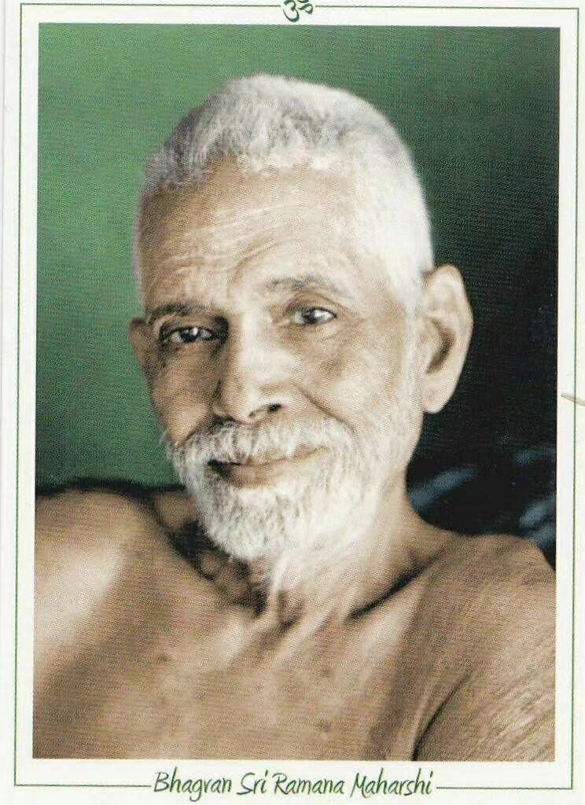

刀锋：The Razor's Edge。The Razor's Edge在英文当中是一个短语，除了表示剃刀边缘、刀锋之义外，还有千钧一发的含义，形容处在危险之中。

那么，把刀锋作为书名，毛姆究竟想表达什么意思呢？

毛姆在小说的扉页引用了一句印度吠陀文献《奥义书》中的一句话，似乎隐晦地指出了“刀锋”这本小说的主题。

> The sharp edge of a razor is difficult to pass over, thus the wise say the path to Salvation is hard.
> （剃刀之刃难以逾越，故智者云，救赎之道亦是如此。）
> ——《 羯陀奥义书》

但如何理解这句话，就是个问题了。我读完了小说，回过头来重新审视这句哲言，仍然感到疑惑：刀锋不容易越过和得救之道有什么关系？ 

再者，如果用刀锋来比喻修行之路上的艰难险阻似乎有点牵强。用高山、大河、沙漠、妖魔鬼怪来比喻这些阻碍，我们似乎更容易理解。

我在网上浏览了一下，看来不止我一人，很多网友也是不知所云，莫衷一是。

有网友是这样理解的：

> 一把刀有两个面 ，我们这些生活在尘世中的俗人只是停留在刀的一个面上， 而要到达另一面（即所谓得救之道），就必须越过刀锋。但是刀锋是如此锐利，寻常人难以越过。为何难以越过？因为在越过刀锋之时，刀锋将斩断你与尘世间的一切联系，而我们这些俗人是不舍得斩断的。
> ——知乎， Billot

有网友是这样理解的：

> 有人说，自己在二十几岁的时候读《刀锋》，会因为这个书名想到，刀很锋利，可以切割。所以脑中浮现的画面就会是一个人尝试走在刀尖上，脚被割伤了，流着血。但如果把这个意象放在上下文中，也就是小说本身中去理解，又好像并没有太多关联。
> 但是40岁以后，他才意识到毛姆恐怕不是这个意思，因为刀锋除了锋利以外，还极为狭窄，而在精神世界里，思想的道路也是非常狭窄的，很难待在上面，极易掉落。这就像那句话： “富人要得救，比骆驼穿过针眼还要难。”
> ——知乎，李青尧

有网友是这样理解的：

> 毛姆使用的译文是Swami和Frederick翻译的Katha-Upanishad，这是节选，我认为因此误导了译者。“pass over”被翻译为“越过”，这样很难解释书的内容，并会出现我出现的疑问，而翻译为“通过”的话，就和其它的翻译意思所指的一样--刀锋喻为通往真知的路。
> 那么首页的题词，应翻译为：寻找真知、解救自我的过程是艰难的，就像行走在锋利的刀锋上，所以智者说得道是困难的。这样对书中的的内容也能有个更好的理解。窃以为，毛姆以刀锋为书名正是为此---得救之道如刀锋般锋利难行，主人公拉里，经历了身体和精神上的折磨，从出世到入世，仍行走于“刀锋”之上，前进不停。
> ——网络，作者不明

总体下来，有两种观点。一种观点是强调刀锋的锋利，另一种观点是强调刀锋的狭窄。

那么，看完这本小说，我更倾向于哪种观点呢？

我看了一些网友的考证资料，再结合我对毛姆思想和小说本身的理解，我本人更倾向于后一种观点：精神上的修行之路像刀锋一样狭窄难行，只有极少数的人能够成为刀锋上的行者。就像拉里那样。

1、《奥义书》原文

毛姆在扉页上引用那句话并非《奥义书》中的原始条目， 这句话是从《奥义书》中的一个条目出发得到的：

> Arise, awake, and learn by approaching the exalted ones, for that path is sharp as a razor's edge, impassable, and hard to go by, say the wise.
> （起来，醒来，通过接近崇高的人来学习，因为那条路像剃刀之刃一样锋利，无法通行，难以通过，智者说。）
> ——Katha Upanishad 1-III-14.

从“hard to go by”可以看出是指沿着刀锋行走很困难，而不是从这一面逾越到另一面。

网友又列出一些针对上面这句哲言的解释，可供参考，但我没看到出处。

> Living on the razor's edge means finding power, meaning, and peace through change.
> （生活于刀锋之上意味着通过改变找到力量、意义和和平.）

> It's not the cutting sharpness of the razor's edge that is the idea, but its extreme narrowness, the idea that the spiritual path is very narrow, very hard to stay on, extremely easy to fall off of.
> （不是剃刀之刃极其锋利，而是它的极端狭窄。精神道路非常狭窄，很难保持，极易跌落。）

2、格涅沙大师的原型

书中拉里最后在印度南部遇到了格涅沙大师，一位瑜伽师，并在这位圣者的指引下获得生命的顿悟。

毛姆曾经在1938年探访过印度南部，并见到了那里的马哈希大师（ Guru Sri Ramana Maharshi），他被认为是书中拉里拜访的格涅沙大师的原型。

> 我告诉过你他的长相；我没有告诉你的是他所焕发出来的那种安详，那种善良、平和、无私。长途颠沛之后我又热又累，可我开始感到了非常舒坦轻松。在他再次开口之前我已明白，这便是我要寻找的人。
> ——《刀锋》，毛姆

拉里通过不断地汲取知识、体验生活、观察世界，以及接近崇高的人来学习，一步步地找到了人生的意义。正如刀锋之上行走，这是一条少有人走的路。

参考：
1、《刀锋》，\[英\]毛姆 著，韦清琦 译，江西人民出版社，2017年
2、毛姆《刀锋》开头的那段引言什么意思？ https://www.zhihu.com/question/21447031
3、兀自对《刀锋》扉页题词做个小解释， https://www.evernote.com/shard/s111/sh/5db75bbd-f904-443c-91ec-d366a799cabe/98d893b35aa2663d8f7ee6140a4122d5