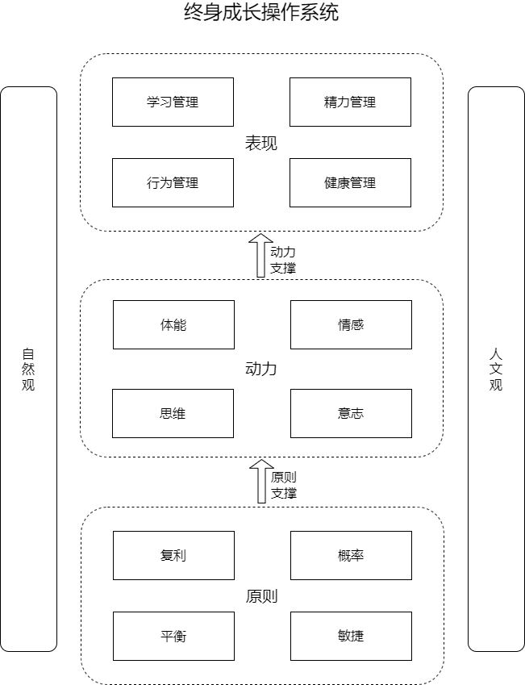
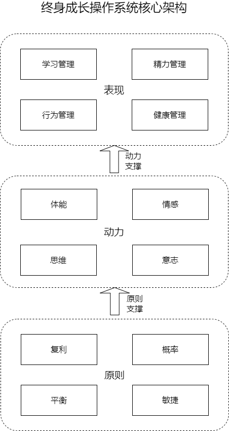

终身成长操作系统的框架设计已经迭代了三个版本，后面可能还会不断完善。

框架已经建立，可以在这个基础上开始下个阶段的工作了。

从今天开始，进入到模块级别的设计实现阶段，过程中再根据实际情况优化框架设计。

一边设计一边实现，一边实现一边设计，这就是演化式设计，也是敏捷思想的具体体现。

打造终身成长操作系统，我采用自己熟悉的软件系统设计开发的思路来进行。

最新版本的终身成长操作系统的框架如下：

前期，我们先不考虑两侧的“自然观”和“人文观”两大模块，因为这两个模块属于辅助的外围模块，严格意义上不算是终身成长操作系统的子模块，只是关联模块而已。

去掉这两个外围模块，框架结构变成这样：

这个框架属于典型的分层架构模式。

分层架构模式，在软件系统的设计开发中，是最常见的一种架构模式。

因为它更符合我们的思维习惯，层次分明，结构清晰，易于理解。

在实现层面上，一般有两种实现路径：自上而下的路径和自下而上路径。

所谓自上而下的路径，就是先从上层模块开始，把需要的操作界面设计出来，系统直接呈现出来的可操作的具体方法和路径是什么？

比如学习管理，它具体的方法是什么？如何展开实践？

而操作界面用到的底层模块，还属于待定的状态，需要逐级向下展开实现。

所以自下而上的路径，就是我们先从底层模块开始，把需要的原子模块设计实现出来，它们是系统构建的基础。

比如什么复利的思想？什么是敏捷的思想？情感和意志，在系统中的定义和范畴是什么？

然后像搭积木一样，把这些原子模块搭建成更大的模块，逐级向上搭建，最终呈现出来系统的全貌。

在实际的软件系统的设计开发中，我们通常会采用自上而下和自下而上相结合的方式。

这是一种工程实践中摸索出来的最佳模式，符合我们大脑的工作原理。

我们的大脑有两种工作模式：专注模式和发散模式。

打个形象的比喻，这两种思维模式就好比手电筒的聚焦模式和广角模式。

在聚焦模式下，亮度很强，可以很清楚地看清一块地方，但范围有限。

在广角模式下，亮度比较弱，但却可以看见更大的一片区域。

自上而下的路径，利用了大脑的发散模式，让我们更关注于系统的全局和整体。

自下而上的路径，利用了大脑的专注模式，聚焦于具体的点，但容易忽视全局。

两种设计路径的结合，刚好优势互补，既关注了系统全局，又落实于细节，上下合围，效果最佳。

所以，我们的终身成长操作系统的构建，也采用这种上下合围的思路。