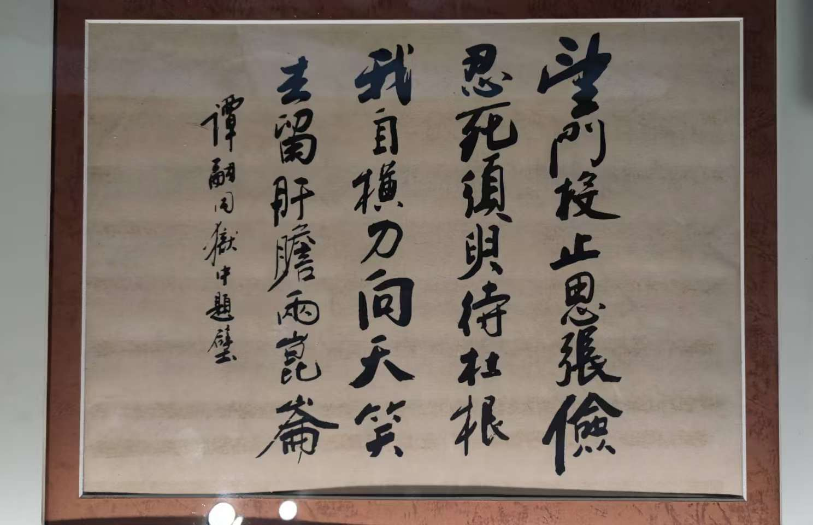

周日去北京宣南文化博物馆游览，看到“戊戌六君子”之一的谭嗣同的狱中题壁诗。

> 望门投止思张俭，忍死须臾待杜根。
> 我自横刀向天笑，去留肝胆两昆仑。
>   —— 狱中题壁，谭嗣同

我们通常对后两句非常熟悉，上学的时候大概都背过。但对前两句就没什么印象，也不大了解其含义。

我赶紧上网查了一下，才知道这两句引用了两个典故，都来自于《后汉书》。

“望门投止思张俭”的典故出自《后汉书・张俭传》。

原文为 “张俭亡命困迫，望门投止，莫不重其名行，破家相容”。

讲述的是东汉时期，山阳高平人张俭因弹劾宦官侯览，被其反诬 “结党”，被迫逃亡。逃亡途中，张俭每到一处便投奔人家请求收容，人们因敬重他的声名和德行，都冒着家破人亡的危险收留他。

此处谭嗣同以张俭之事，表达对出逃的康有为、梁启超等人的牵挂，希望他们能得到保护 。

“忍死须臾待杜根”的典故出自《后汉书·杜栾刘李刘谢列传》。

东汉永初元年，杜根被推举为孝廉，担任郎中，当时和熹邓太后执政，杜根认为汉安帝已长大成人，反对邓太后长期摄政，便上书直谏。太后大怒，下令将杜根装入布袋中扑杀，执法者因同情杜根而暗中保护，行刑时未用力，之后用车将其接出城，杜根得以苏醒。太后派人检查时，杜根装作假死，甚至眼中生蛆，太后信以为真，杜根才得以逃脱，到宜城山中做了十五年酒保。直到建光元年，邓氏一族倒台，汉安帝昭告天下寻找杜根的子孙准备录用为官，此时杜根刚回到老家，就被奉为公车，又拜为侍御史。

谭嗣同引用此典故，是希望维新派人士能像杜根一样忍死求生，等待时机，以完成变法维新的大业.

后两句 “我自横刀向天笑，去留肝胆两昆仑”，则彰显了谭嗣同大义凛然、视死如归的英雄气概，他愿以死来唤醒国人，为变法牺牲。

对于 “去留肝胆两昆仑” 有不同解读，一种说法是 “去” 指康有为，“留” 指谭嗣同自己，二人虽一去一留，但都为变法做出贡献，肝胆相照；另一种说法是指谭嗣同的浩然之气如昆仑山一样雄伟，永留天地之间。