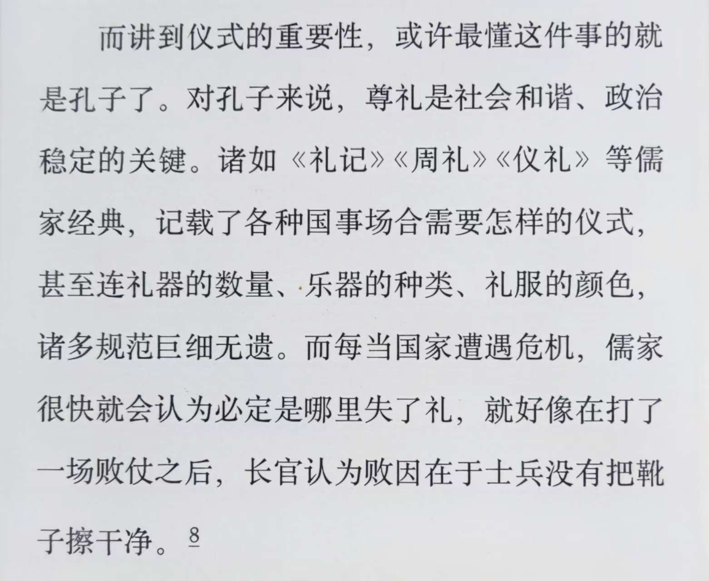
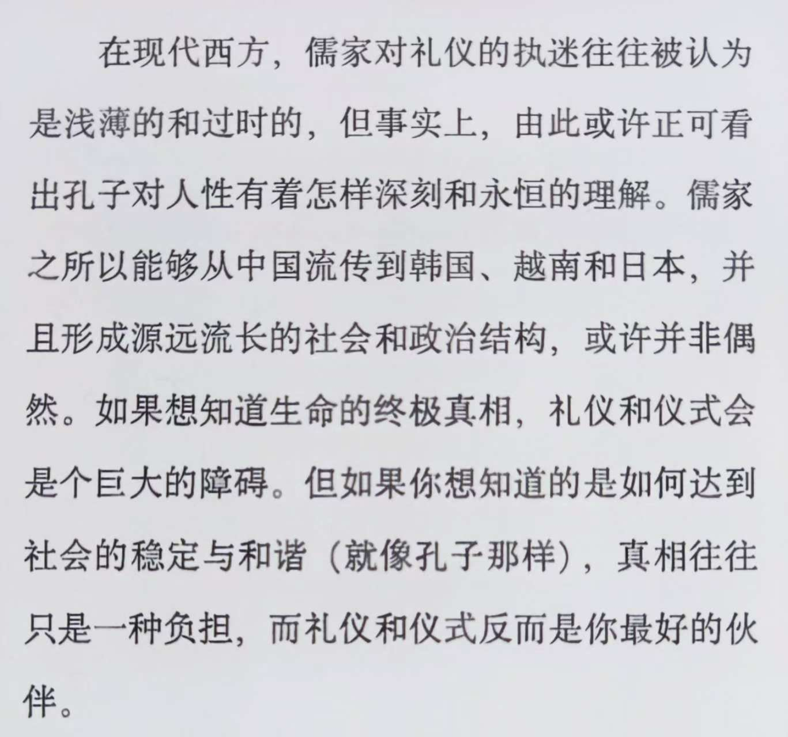

这个周末，刚刚看完尤瓦尔·赫拉利的《今日简史》，再加上之前的《人类简史》和《未来简史》，他的“简史三部曲”，算是全部泛读了一遍。

尤瓦尔·赫拉利是我非常喜欢的全球顶级的学者和作家，他的“简史三部曲”，针对人类社会，展示了一个宏大开阔的视野，犹如站在云层之上，去俯瞰智人这个物种的发展和变迁。

今天，我并非要写《今日简史》的读后感，而是阅读的过程中，意外地看到赫拉利有一段对孔子和儒家的不俗见解，有感而发，说一点自己的体会和反思。

赫拉利之所以提到了孔子，以及儒家的礼仪，是基于他一个深刻的洞察：

> 让人生有意义、让人有身份认同的故事，虽然都是虚构的，但人类还是得相信这些故事。那么，怎样才能让人感觉故事是真的呢？早在几千年前，祭司和巫师就已经找到了答案：靠各种仪式。“仪式”是一种神奇的行为，能让抽象变得具体、虚构变得真实。

接下来，赫拉利对孔子以及儒家思想做了一个精辟的论述：

赫拉利作为一个犹太学者，对东方的儒家学说和先贤孔子，有着这样中正深刻的理解，让我敬佩不已。

世上很多的人，对自己不真正了解的思想学说，存有傲慢与偏见。

对于孔子和儒家的傲慢与偏见，不但在现代西方存在，在他的诞生地实际上更为普遍。很多中国人甚至都没有读过《论语》，也没有真正了解过孔子的一生，只是听了一些历史上君君臣臣、三从四德的传闻，就对孔子不屑一顾，对儒家嗤之以鼻，轻松地扫入了垃圾堆。

从赫拉利对待孔子和儒家的态度上，我可以感受到一种更为开阔、包容、中正、严谨的治学态度。

我相信，赫拉利作为一个全球视野的学者，广泛涉猎，博览群书，儒家的学说只是他广阔视野中的一隅。他并非儒家的信徒，对孔子的思想和学说也不会百分百的认同，但他对对孔子的崇敬，对儒家学说的深刻洞察，甚至超过了很多儒家的信徒。他对儒学所表现出来的不偏不倚的中正态度，恰恰符合孔子的中庸之道。

这是一个真正的学者，对历史先贤一种发自内心的敬意，对曾经深刻影响人类思想和生活方式的儒家学说一种审慎的公正。

对于任何一个曾经影响过世界，或者说至少影响过一个文化区域的宗教或学说，都不应该用浅薄的偏见去武断地下结论。

如果想要去评判它，那就首先去了解它。否则就应该大方地承认自己的无知，而不是说它错了，或者说是一坨垃圾而已。

如果从来就没有尝试去了解一个事物，就断定它毫无价值，或者说大错特错，那就是最大的傲慢与偏见。

扪心自问，我对待自己不了解的思想学说，是怎样的态度呢？是不是在完全无知的情况下，就随意评判过它们呢？

我需要对自己诚实，承认自己的无知，遵循孔子“知之为知之，不知为不知”的信条，而不是心存傲慢与偏见，不懂装懂，随意下结论或加以评判。
